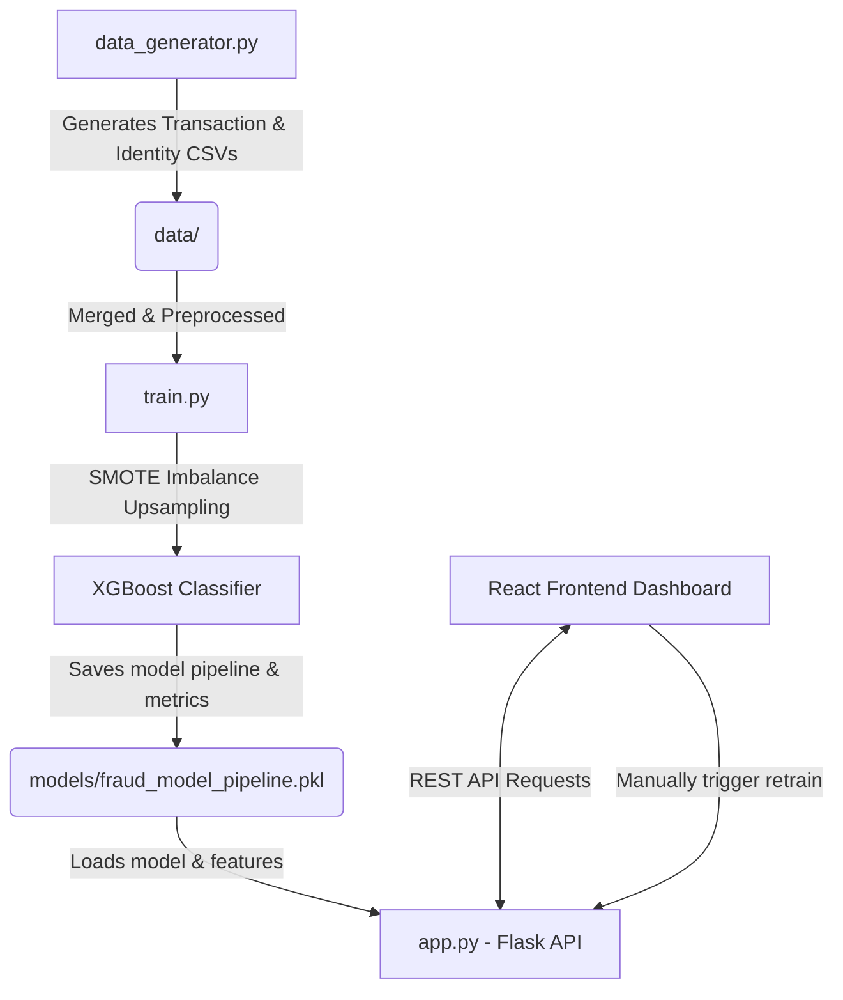

# Credit Card Fraud Detection Application

An end-to-end, real-time credit card fraud detection system modeled after the **Kaggle IEEE-CIS Fraud Detection dataset**. The system utilizes an **XGBoost Classifier** with class imbalance handled via **SMOTE (Synthetic Minority Over-sampling Technique)**, served via a **Flask REST API**, and visualized in an interactive, responsive **React (Vite) Dashboard** built with a premium glassmorphic dark theme.

---

## 🚀 Key Features

*   **Synthetic High-Fidelity Dataset:** Includes a data generator that creates transactions and identity logs matching the schema, correlation structures, and missingness of the IEEE-CIS Kaggle competition.
*   **Imbalance Calibration:** Uses SMOTE to address extreme class imbalance (typically ~3.5% fraud rate), upsampling the minority class to 50/50 during training.
*   **XGBoost Classifier:** Trains a robust model reporting accuracy, validation ROC-AUC, precision, recall, and F1-score.
*   **Real-time REST API:** Exposes endpoints to check service health, evaluate performance, fetch transaction histories, score incoming transactions in real-time, and trigger retraining.
*   **Interactive React Dashboard:**
    *   **KPI Metrics Overview:** Radial/linear indicators of Accuracy, Fraud Rate, Total Ledger Volume, and Average Amounts.
    *   **Interactive SVG Charts:** Features a transaction stream area chart and a category-wise risk bar chart with clean hover effects (zero external library dependencies, meaning React 19 compatibility).
    *   **Ledger & Inspector:** Displays searchable and filterable transactions. Clicking a transaction opens a slide-over details drawer showing all Vesta engineering features and cardholder device metadata.
    *   **Prediction Terminal:** Sandbox form allowing analysts to manually input transaction details and see real-time probability gauges.
    *   **Tuning & Retraining Console:** Displays a visual Confusion Matrix and lets users adjust training sample sizes to retrain the classifier on-demand.

---

## 📐 System Architecture



---

## 📁 Project Structure

```
├── backend/
│   ├── app.py                  # Flask REST API Web Server
│   ├── data_generator.py       # High-fidelity synthetic dataset generator
│   ├── train.py                # Preprocessing, SMOTE, and XGBoost training pipeline
│   └── verify_pipeline.py      # Diagnostic pipeline test script
├── frontend/
│   ├── public/                 # Static assets
│   ├── src/
│   │   ├── App.jsx             # React Dashboard component & application state
│   │   ├── index.css           # Vanilla CSS custom layout & glassmorphic styles
│   │   └── main.jsx            # React mounting entry point
│   ├── index.html              # HTML shell importing Google Fonts
│   ├── vite.config.js          # Vite server settings
│   └── package.json            # React project dependencies
├── data/                       # Generated dataset storage (git-ignored)
├── models/                     # Pickled pipelines and metadata (git-ignored)
└── .gitignore                  # Git tracking exclusions
```

---

## 💻 Setup & Running Instructions

### Prerequisites
*   **Python 3.8+**
*   **Node.js 18+ and NPM**

### 1. Backend Service Setup
First, install the Python libraries and start the Flask web server:

```bash
# Install dependencies
pip install xgboost flask-cors pandas numpy scikit-learn imbalanced-learn flask

# Run the Flask API server
python backend/app.py
```
*Note: On startup, the server checks if datasets/models exist. If not, it automatically runs `data_generator.py` and `train.py` to train the XGBoost classifier, saving the pipeline before starting the server on `http://127.0.0.1:5000`.*

### 2. Frontend Dashboard Setup
In a new terminal window:

```bash
# Navigate to frontend directory
cd frontend

# Install package dependencies
npm install

# Run the React Vite development server
npm run dev
```
*Note: Open `http://localhost:5173/` in your browser to view the dashboard. If the Flask server is offline, the React app automatically falls back to an offline simulated state so you can still preview metrics, run sandbox predictions, and trigger mock retraining.*
